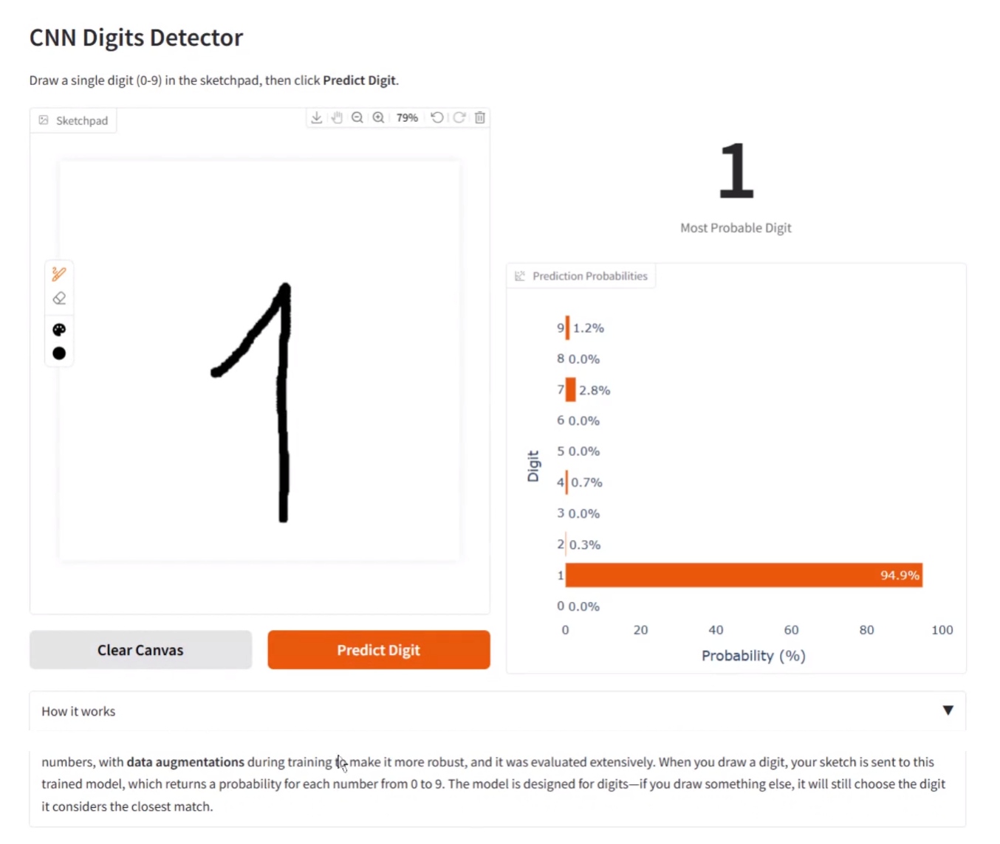
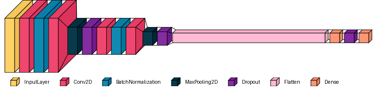
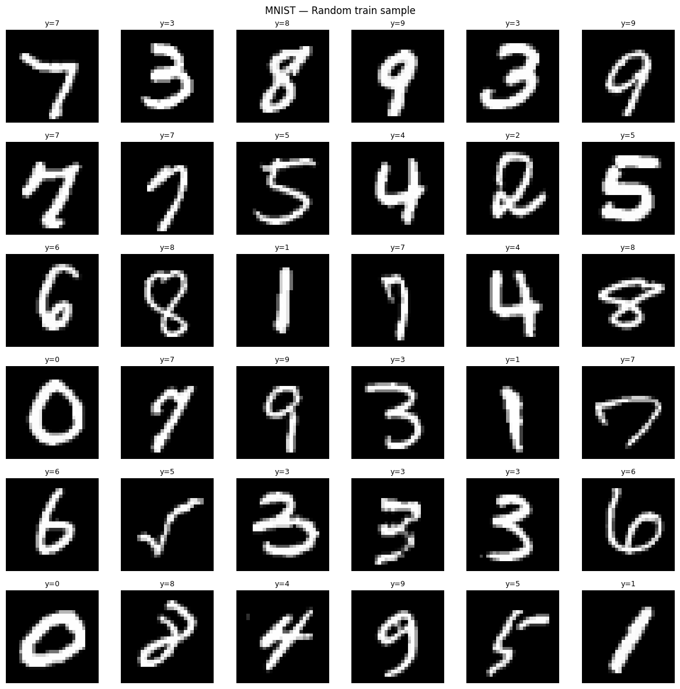
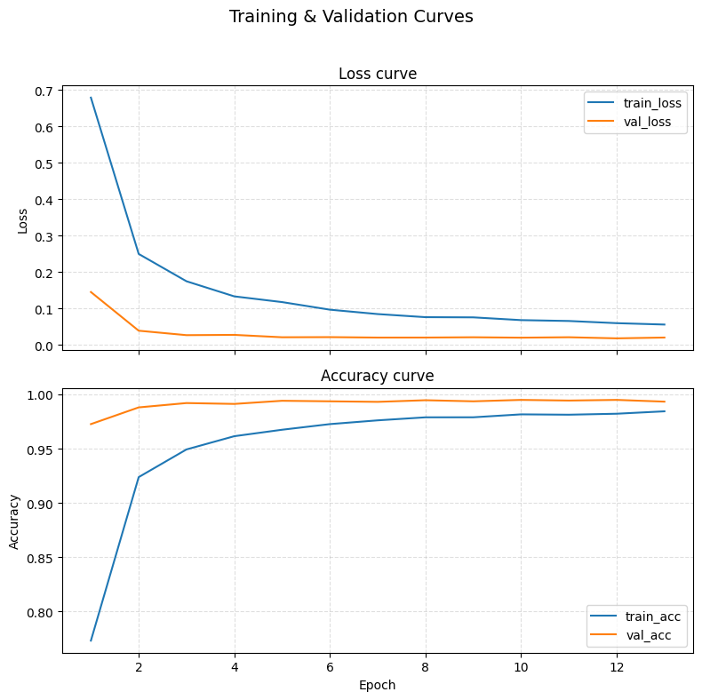
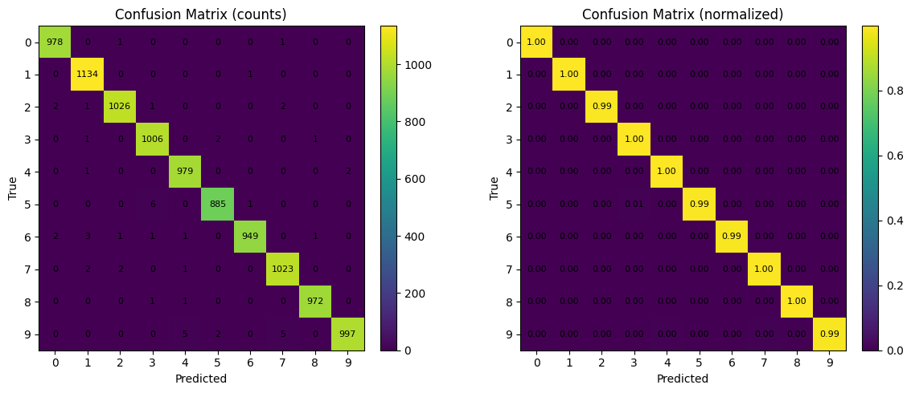
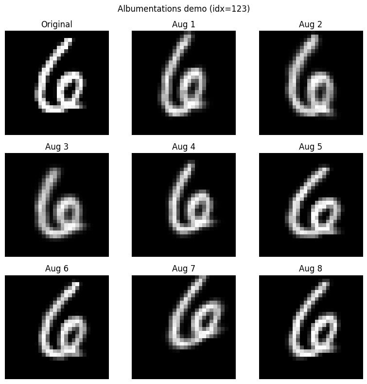

# CNN Digits Detector

A compact, production-grade demonstration of handwritten digit recognition that combines a carefully regularized **Convolutional Neural Network (CNN)** with a clean, interactive **Gradio** interface. The application allows users to draw a digit (0–9) on a sketchpad and immediately review both the top prediction and the complete probability distribution.

**Live demo (Hugging Face Spaces):** https://huggingface.co/spaces/marcoom/cnn-digits-detector


---

## System Architecture


The system implements a straightforward data flow pipeline: users draw handwritten digits on the **Gradio web interface's** interactive sketchpad, which captures and preprocesses the input into a 28x28 grayscale image. This image is then passed to the **pre-trained CNN model** for inference, where multi-class classification is performed to determine digit probabilities. The model's predictions are returned to the **Gradio interface**, which displays both the top prediction and the complete probability distribution through an interactive bar chart with hover details.




## Features

- **Robust CNN for digit recognition**  
  A lightweight yet high-performing CNN architecture trained on MNIST with targeted augmentations to improve generalization to varied handwriting.

- **Evaluated and ready to run**  
  The repository includes a pre-trained `.keras` model and evaluation artifacts

- **Interactive Gradio interface**  
  A streamlined sketchpad for digit input, clear/reset controls, and an interactive probability bar chart with on-bar percentages and hover details for quick inspection.

---

## Model Architecture



The CNN architecture consists of a backbone made of two convolutional blocks, followed by a classification head composed of two dense layers:

```
┏━━━━━━━━━━━━━━━━━━━━━━━━━━━━━━━━━┳━━━━━━━━━━━━━━━━━━━━━━━━┓
┃ Layer (type)                    ┃ Output Shape           ┃
┡━━━━━━━━━━━━━━━━━━━━━━━━━━━━━━━━━╇━━━━━━━━━━━━━━━━━━━━━━━━┩
│ input_layer (InputLayer)        │ (None, 28, 28, 1)      │
├─────────────────────────────────┼────────────────────────┤
│ conv2d (Conv2D)                 │ (None, 28, 28, 32)     │
├─────────────────────────────────┼────────────────────────┤
│ batch_normalization             │ (None, 28, 28, 32)     │
│ (BatchNormalization)            │                        │
├─────────────────────────────────┼────────────────────────┤
│ conv2d_1 (Conv2D)               │ (None, 28, 28, 32)     │
├─────────────────────────────────┼────────────────────────┤
│ max_pooling2d (MaxPooling2D)    │ (None, 14, 14, 32)     │
├─────────────────────────────────┼────────────────────────┤
│ dropout (Dropout)               │ (None, 14, 14, 32)     │
├─────────────────────────────────┼────────────────────────┤
│ conv2d_2 (Conv2D)               │ (None, 14, 14, 64)     │
├─────────────────────────────────┼────────────────────────┤
│ batch_normalization_1           │ (None, 14, 14, 64)     │
│ (BatchNormalization)            │                        │
├─────────────────────────────────┼────────────────────────┤
│ conv2d_3 (Conv2D)               │ (None, 14, 14, 64)     │
├─────────────────────────────────┼────────────────────────┤
│ max_pooling2d_1 (MaxPooling2D)  │ (None, 7, 7, 64)       │
├─────────────────────────────────┼────────────────────────┤
│ dropout_1 (Dropout)             │ (None, 7, 7, 64)       │
├─────────────────────────────────┼────────────────────────┤
│ flatten (Flatten)               │ (None, 3136)           │
├─────────────────────────────────┼────────────────────────┤
│ dense (Dense)                   │ (None, 128)            │
├─────────────────────────────────┼────────────────────────┤
│ dropout_2 (Dropout)             │ (None, 128)            │
├─────────────────────────────────┼────────────────────────┤
│ dense_1 (Dense)                 │ (None, 10)             │
└─────────────────────────────────┴────────────────────────┘

Total params: 468,202 (1.79 MB)
Trainable params: 468,010 (1.79 MB)
Non-trainable params: 192 (768.00 B)
```

**Architecture highlights:**
- Two convolutional blocks with 32 and 64 filters respectively
- Batch normalization for training stability
- Max pooling for spatial dimension reduction
- Dropout layers (rates optimized during training) for regularization
- Dense layers with 128 hidden units leading to 10-class output

---

## Quickstart

### Local (Python 3.12)

- Create and activate a virtual environment
  ```bash
  python3.12 -m venv .venv
  source .venv/bin/activate           # Windows: .venv\Scripts\activate
  ```
- Install dependencies
  ```bash
  pip install --upgrade pip
  pip install -r requirements.txt
  ```
- Launch the app
  ```bash
  python app.py
  ```
- Access the app from a browser, on http://localhost:7860/


### Docker

- Build and run using the included Dockerfile
  ```bash
  docker build -t cnn-digits-detector:latest .
  docker run --rm -p 7860:7860 cnn-digits-detector:latest
  ```
- Access the app from a browser, on http://localhost:7860/

> A published image is also available at:  
**Docker Hub:** https://hub.docker.com/r/marcoom/cnn-digits-detector

---

## Training & Evaluation
> Model training is performed in [`digits_detector_cnn_training.ipynb`](./digits_detector_cnn_training.ipynb)

The model is trained and evaluated on the **MNIST dataset**, which consists of 70,000 grayscale images of handwritten digits (0-9), each 28x28 pixels in size. The dataset is split into 60,000 training images and 10,000 test images.



### Model Performance




- **Overall test accuracy:** **99.49%** (MNIST test set)  
- Training and validation curves indicate stable convergence with minimal generalization gap  
- The confusion matrix shows uniformly strong performance with only rare confusions among visually similar digits

### Data Augmentation
Training employs light geometric and elastic transformations during training to increase handwriting variability while preserving label fidelity:

- Small **shifts, scaling, and rotations**
- Mild **shear/Affine** adjustments
- Occasional **elastic/grid distortions** and minor **crop/pad** operations

Augmentations are applied **on-the-fly** during batch generation to maintain diversity across epochs.



### Retraining

To reproduce or extend the model:

- Open `notebooks/digits_detector_cnn_training.ipynb`
- Run the notebook to train and export a new `.keras` model
- Manually move the generated model file to the `models/` directory, replacing the previous `mnist_cnn_albu.keras`
- Launch `app.py` to test the updated model

---

## Project Structure

```text
.
├── app.py                         # Gradio app: sketchpad UI + prediction + probability chart
├── Dockerfile                     # Container build (exposes Gradio on 7860)
├── LICENSE                        # MIT License
├── media/                         # Images & assets used in README and docs
├── models/
│   └── mnist_cnn_albu.keras       # Pretrained model (ready to run)
├── notebooks/
│   └── digits_detector_cnn_training.ipynb  # Training & export pipeline
├── README.md
└── requirements.txt               # Python dependencies (pinned for Python 3.12)
```

---

## License

This project is released under the **MIT License**. See [`LICENSE`](./LICENSE) for details.